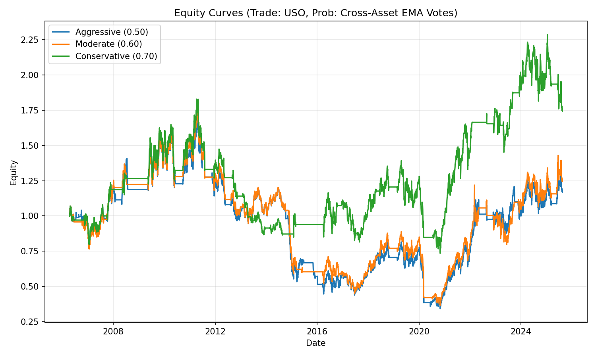

# 451_Assignment-7
# Jump-Start: Adding Cross‑Asset Features to a Financial ML Model

## Overview
This repository contains the **jump-start code** for extending a basic financial prediction model with **cross‑asset features** and a simple **rule‑based trading overlay**. The target market is West Texas Intermediate (WTI) crude oil (proxied in trading by **USO**). The notebook evaluates whether information from other asset classes helps predict next‑day movements and whether such signals can be converted into an automated strategy with different **risk thresholds** (Aggressive 0.50, Moderate 0.60, Conservative 0.70).

The jump-start follows the class handout: start from a simple feature (“Up” indicator) and optionally test a momentum variant using **EMA(40/80)**. Results are visualized as equity curves and summarized in the accompanying report.

---

## Repository Structure
```
.
├── Data/                        # Input daily OHLC/close data (CSV)
│   ├── gld_daily_data.csv
│   ├── ive_daily_data.csv
│   ├── slv_daily_data.csv
│   ├── spy_daily_data.csv
│   ├── uso_daily_data.csv
│   ├── vb_daily_data.csv
│   ├── vgt_daily_data.csv
│   ├── wti_daily_data.csv
│   ├── xli_daily_data.csv
│   └── xlu_daily_data.csv
│
├── equity_curves.png            # Output figure: Aggressive/Moderate/Conservative equity curves
├── Week7_Assignment3_Report.pdf # Checkpoint write‑up for this jump‑start
├── jump-start-adding-features-to-ml-mode.ipynb  # Main notebook
└── README.md
```

> **Note**: These CSVs are already included. You do **not** need to re‑download data to run the notebook.

---

## What the Notebook Does
1. **Load data** from `Data/` and align trading calendars across all tickers.
2. **Create cross‑asset features**:
   - *Up Indicator* (default): 1 if yesterday’s **Close** > **Close** two days ago, else 0.
   - *Optional Momentum*: EMA(40) > EMA(80) ⇒ 1, else 0. (You can toggle this in the notebook.)
3. **Aggregate signals** across assets into a **probability score** (fraction of assets signaling “up”).  
4. **Trading overlay** on **USO** using three thresholds: 0.50, 0.60, 0.70. If the score ≥ threshold, go long; otherwise stay in cash. A transaction cost of **5 bps** per trade is applied.
5. **Evaluate and visualize**: compute basic performance stats and save the plot **`equity_curves.png`**.

---

## How to Run
1. Open `jump-start-adding-features-to-ml-mode.ipynb` in Jupyter/VS Code/Colab.
2. Ensure the working directory contains the `Data/` folder shown above.
3. Run all cells. The notebook will read the CSVs, build features, backtest the thresholds, and export `equity_curves.png`.
4. (Optional) In the notebook, switch from the “Up” feature to the **EMA(40/80)** momentum feature to compare results.

**Python version**: 3.9+ recommended.  
**Required packages**: `pandas`, `numpy`, `matplotlib` (the included data avoids the need for API downloads).  
You can install them with:
```bash
pip install pandas numpy matplotlib
```

---

## Interpreting the Output
- The figure **`equity_curves.png`** plots cumulative equity for the three threshold policies.  
  - The **Aggressive (0.50)** curve trades most often and typically shows the largest swings.  
  - The **Conservative (0.70)** curve trades least often and tends to be smoother, sometimes at the cost of missed rallies.
- Because this is a **jump‑start** focused on feature construction, the goal is to understand how different feature definitions and thresholds change the equity curve shape, not to maximize Sharpe yet.



---

## Notes & Tips
- Your CSVs may contain `Close` but not `Adj Close`. The notebook looks for a sensible price column automatically (e.g., `Close`); no manual edits are required.
- If you wish to expand beyond this jump‑start, try:
  - Adding additional features (e.g., RSI, ATR, volatility filters).  
  - Using **time‑series cross‑validation** to estimate out‑of‑sample error.  
  - Stress testing via **block bootstrap Monte Carlo** before turning the model into a live strategy.

---

## Acknowledgments & References
- Andreas Clenow (2019), *Trading Evolved: Anyone Can Build Killer Trading Strategies in Python*.
- Gary Antonacci (2014), *Dual Momentum Investing*.
- MSDS 451 course materials: “Jump‑start—Adding Features to an ML Model.”

---

## GenAI Use
Portions of this README and the explanatory text were drafted with the help of an AI assistant (ChatGPT), then edited and verified for accuracy by the author.
